# Build-Once-Deploy-Many Pattern Guide

## Overview

This guide explains how to use the new **build-once-deploy-many** pattern for Boomi deployments in Azure DevOps. This pattern ensures that the exact same package is deployed across all environments (QA → UAT → Production).

## Why Build-Once-Deploy-Many?

### ❌ Old Pattern (Incorrect)

```
QA Stage:    Create Package A (pkg-qa-123)  → Deploy Package A
UAT Stage:   Create Package B (pkg-uat-456) → Deploy Package B  ← Different!
Prod Stage:  Create Package C (pkg-prod-789) → Deploy Package C  ← Different!
```

**Problems:**
- Different packages in each environment
- "Works in QA but fails in Prod" issues
- Can't guarantee what's in production
- Violates deployment best practices

### ✅ New Pattern (Correct)

```
Build Stage: Create Package (pkg-12345)      ← Built ONCE!

QA Stage:    Deploy Package (pkg-12345)      ← Same package
UAT Stage:   Deploy Package (pkg-12345)      ← Same package  
Prod Stage:  Deploy Package (pkg-12345)      ← Same package
```

**Benefits:**
- ✅ Same artifact deployed everywhere
- ✅ What works in QA will work in Prod
- ✅ Audit trail - know exactly what's deployed
- ✅ Industry best practice

## New Templates

### 1. create_packages.yaml

**Purpose:** Build Boomi package and export packageId for reuse

**Usage:**
```yaml
- template: create_packages.yaml
  parameters:
    componentIds: 'comp-id-1,comp-id-2'
    packageVersion: '1.0.0'
    notes: 'Release notes'
    branchName: 'feature-branch'  # Optional: for Boomi branch/merge
```

**Output:**
- Exports `packageId` variable
- Available in subsequent stages as: `$[stageDependencies.Build_Package.create_package.outputs['output_variable.packageId']]`

### 2. deploy_packages_byId.yaml

**Purpose:** Deploy existing package by ID (does NOT create new package)

**Usage:**
```yaml
- template: deploy_packages_byId.yaml
  parameters:
    packageId: $(packageId)  # From previous stage
    env: 'Production'
    notes: 'Production deployment'
    listenerStatus: 'RUNNING'
```

**Key Difference from deploy_packages.yaml:**
- `deploy_packages.yaml` - Creates NEW package then deploys (OLD way)
- `deploy_packages_byId.yaml` - Deploys EXISTING package by ID (NEW way)

### 3. undeploy_packages_byId.yaml

**Purpose:** Undeploy package by ID (for cleanup)

**Usage:**
```yaml
- template: undeploy_packages_byId.yaml
  parameters:
    packageId: $(packageId)
    env: 'QA'
    componentId: 'comp-id-123'
```

### 4. base_build_approval_deploy.yaml

**Purpose:** Complete pipeline with build-once pattern and approval gates

**Usage:**
```yaml
extends:
  template: ci-templates/azuredevops/pipelines/base_build_approval_deploy.yaml
  parameters:
    packageName: 'my-api'
    componentIds: 'comp-1,comp-2'
    deployToQA: true
    deployToUAT: true
    deployToProd: true
    branchName: 'main'
```

## Pipeline Flow

### Complete Build-Once Flow

```mermaid
flowchart TB
    Start([Pipeline Start]) --> Build
    
    subgraph Build["📦 Build_Package Stage"]
        CreatePkg[Create Package<br/>packageId = pkg-12345]
    end
    
    Build --> QA_Gate{deployToQA?}
    QA_Gate -->|true| QA
    
    subgraph QA["🔧 QA Stages"]
        QA_Deploy[Deploy pkg-12345]
        QA_Test[Unit Testing]
        QA_API[API Testing]
        QA_Deploy --> QA_Test --> QA_API
    end
    
    QA --> UAT_Approval
    QA_Gate -->|false| UAT_Gate
    
    subgraph UAT_Approval["⏸️  UAT Approval Gate"]
        UAT_Wait[Manual Approval<br/>Required]
    end
    
    UAT_Approval --> UAT_Gate{deployToUAT?}
    UAT_Gate -->|true| UAT
    
    subgraph UAT["🔧 UAT Stages"]
        UAT_Deploy[Deploy pkg-12345]
        UAT_Test[UAT Testing]
        UAT_API[API Testing]
        UAT_Comp[UAT Completion]
        UAT_Deploy --> UAT_Test --> UAT_API --> UAT_Comp
    end
    
    UAT --> Prod_Approval
    UAT_Gate -->|false| Prod_Gate
    
    subgraph Prod_Approval["⏸️  Prod Approval Gate"]
        Prod_Wait[Manual Approval<br/>Required]
    end
    
    Prod_Approval --> Prod_Gate{deployToProd?}
    Prod_Gate -->|true| Prod
    
    subgraph Prod["🚀 Production Stage"]
        Prod_Deploy[Deploy pkg-12345]
    end
    
    Prod --> Cleanup
    Prod_Gate -->|false| Cleanup
    
    Cleanup[🧹 Cleanup Test Components]
    Cleanup --> End([Pipeline Complete])
    
    style Build fill:#e3f2fd,stroke:#1976d2,stroke-width:2px
    style QA fill:#fff3e0,stroke:#f57c00,stroke-width:2px
    style UAT_Approval fill:#fce4ec,stroke:#c2185b,stroke-width:2px
    style UAT fill:#f3e5f5,stroke:#7b1fa2,stroke-width:2px
    style Prod_Approval fill:#ffcdd2,stroke:#c62828,stroke-width:2px
    style Prod fill:#ffebee,stroke:#c62828,stroke-width:2px
```



## Setting Up Approval Gates

### Step 1: Create Environments in Azure DevOps

1. Navigate to **Pipelines** → **Environments**
2. Click **+ New environment**
3. Create three environments:
   - Name: `UAT`
   - Name: `Production`

### Step 2: Configure Approvers for UAT

1. Go to **Pipelines** → **Environments** → **UAT**
2. Click **⋮** (three dots) → **Approvals and checks**
3. Click **+** → **Approvals**
4. Configure:
   - **Approvers**: Add "Lead Integration Members" group or specific users
   - **Minimum number of approvers**: 1
   - **Timeout**: 7 days
   - **Instructions**: "Review QA test results before approving UAT deployment"
5. Click **Create**

### Step 3: Configure Approvers for Production

1. Go to **Pipelines** → **Environments** → **Production**
2. Click **⋮** → **Approvals and checks**
3. Click **+** → **Approvals**
4. Configure:
   - **Approvers**: Add "Product/Deployment Managers" group or specific users
   - **Minimum number of approvers**: 2 (for critical systems)
   - **Timeout**: 30 days
   - **Instructions**: "Review UAT results. WARNING: This deploys to PRODUCTION!"
5. Click **Create**

### Step 4: (Optional) Add Additional Checks

**Business Hours Check:**
1. Environment → **Approvals and checks** → **+** → **Business hours**
2. Restrict prod deployments to business hours only

**Branch Control:**
1. Environment → **Approvals and checks** → **+** → **Branch control**
2. Only allow deployments from `main` or `release/*` branches

## Migration Guide

### For New Projects

Simply use `base_build_approval_deploy.yaml` from the start:

```yaml
extends:
  template: ci-templates/azuredevops/pipelines/base_build_approval_deploy.yaml
  parameters:
    packageName: 'my-api'
    componentIds: 'comp-id-1,comp-id-2'
    deployToQA: true
    deployToUAT: true
    deployToProd: true
```

### For Existing Projects

If you have existing pipelines using older patterns, you can migrate to the build-once pattern at your own pace. The new templates are additive and don't break existing workflows.

**Recommended migration steps:**
1. Test the new pattern with a non-critical pipeline first
2. Configure approval gates in Azure DevOps
3. Gradually migrate production pipelines
4. Verify package IDs are reused across stages

### Breaking Changes

**None!** The new templates are additive:
- New pipelines use `base_build_approval_deploy.yaml`
- Migrate at your own pace
- All templates are forward-compatible

## Example Pipelines

### Example 1: Simple Build-Once Pipeline

**File:** `my-api.yaml`

```yaml
parameters:
  - name: deployToQA
    type: boolean
    default: false
  - name: deployToUAT
    type: boolean
    default: false
  - name: deployToProd
    type: boolean
    default: false

pool:
  name: Default

extends:
  template: ci-templates/azuredevops/pipelines/base_build_approval_deploy.yaml
  parameters:
    packageVersion: '0'  # Auto-generate version
    packageName: 'my-api'
    componentIds: 'component-id-1,component-id-2'
    notes: 'My API deployment'
    deployToQA: ${{ parameters.deployToQA }}
    deployToUAT: ${{ parameters.deployToUAT }}
    deployToProd: ${{ parameters.deployToProd }}
```

### Example 2: With Boomi Branch Support

```yaml
parameters:
  - name: branchName
    type: string
    default: 'main'

extends:
  template: ci-templates/azuredevops/pipelines/base_build_approval_deploy.yaml
  parameters:
    packageVersion: '0'
    packageName: 'feature-api'
    componentIds: 'comp-1,comp-2'
    branchName: ${{ parameters.branchName }}  # ✅ Uses Boomi branch/merge
    deployToQA: true
```

### Example 3: With Unit Tests and API Testing

```yaml
extends:
  template: ci-templates/azuredevops/pipelines/base_build_approval_deploy.yaml
  parameters:
    packageVersion: '0'
    packageName: 'full-api'
    
    # Main components (packaged once)
    componentIds: 'comp-1,comp-2,comp-3'
    
    # Test components (created at each stage)
    test_componentIds: 'test-comp-1'
    
    # API testing
    postmanCollection: 'api-tests.json'
    sleepInMinutes: 2
    
    deployToQA: true
    deployToUAT: true
    deployToProd: true
```

## Boomi Branch/Merge Feature

### What is Boomi Branch/Merge?

Boomi supports Git-style branches for components. You can:
- Create feature branches in Boomi
- Package components from specific branches
- Merge branches when ready

### Using Branch Name in Pipeline

**CLI Support:**
All packaging scripts support the `branchName` parameter:

```bash
source bin/createPackages.sh \
  componentIds="comp-1,comp-2" \
  packageVersion="1.0.0" \
  branchName="feature-branch"  # ✅ Supported
```

**Pipeline Support:**
```yaml
extends:
  template: ci-templates/azuredevops/pipelines/base_build_approval_deploy.yaml
  parameters:
    branchName: 'feature/new-api'  # ✅ Package from this branch
```

**How It Works:**
1. When `branchName` is provided, scripts use Boomi Platform API
2. Package is created from specified branch
3. Deployment uses the branch-specific components

## Troubleshooting

### Package ID Not Found

**Problem:** `packageId` variable is empty in deployment stages

**Solution:**
```yaml
# Verify output variable name matches
variables:
  packageId: $[stageDependencies.Build_Package.create_package.outputs['output_variable.packageId']]
  #                           ^^^^^^^^^^^^^ Stage name
  #                                        ^^^^^^^^^^^^^^ Job name
  #                                                       ^^^^^^^^^^^^^^^ Output variable name
```

### Approval Not Triggered

**Problem:** Pipeline skips approval and goes straight to deployment

**Solution:**
1. Verify environment exists: **Pipelines** → **Environments** → **Production**
2. Verify approval is configured on the environment
3. Check stage has `environment: Production` in deployment job

### Different Package Deployed

**Problem:** Each environment gets a different package

**Solution:**
- ❌ You're using `deploy_packages.yaml` (creates NEW package)
- ✅ Use `deploy_packages_byId.yaml` (deploys EXISTING package)
- ✅ Or use `base_build_approval_deploy.yaml` (handles this automatically)

## Best Practices

### DO ✅

- **Use base_build_approval_deploy.yaml for production pipelines**
- **Configure approval gates for UAT and Production**
- **Set minimum 2 approvers for production**
- **Use branch names for feature branch deployments**
- **Review test results before approving**
- **Document approval decisions**

### DON'T ❌

- **Don't build packages at multiple stages** (use build-once pattern)
- **Don't skip approval gates**
- **Don't approve without reviewing test results**
- **Don't deploy to production outside business hours** (configure business hours check)

## Support

For issues or questions:
1. Check this guide first
2. Review [Azure DevOps SETUP.md](SETUP.md)
3. Check [CLI Reference](../../docs/CLI_REFERENCE.md)
4. Review validation report for detailed architecture

---

**Last Updated:** 2026-01-29  
**Version:** 1.0.0
