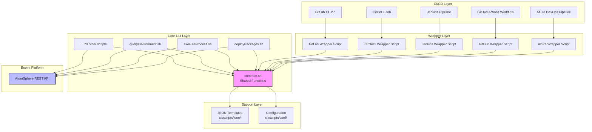
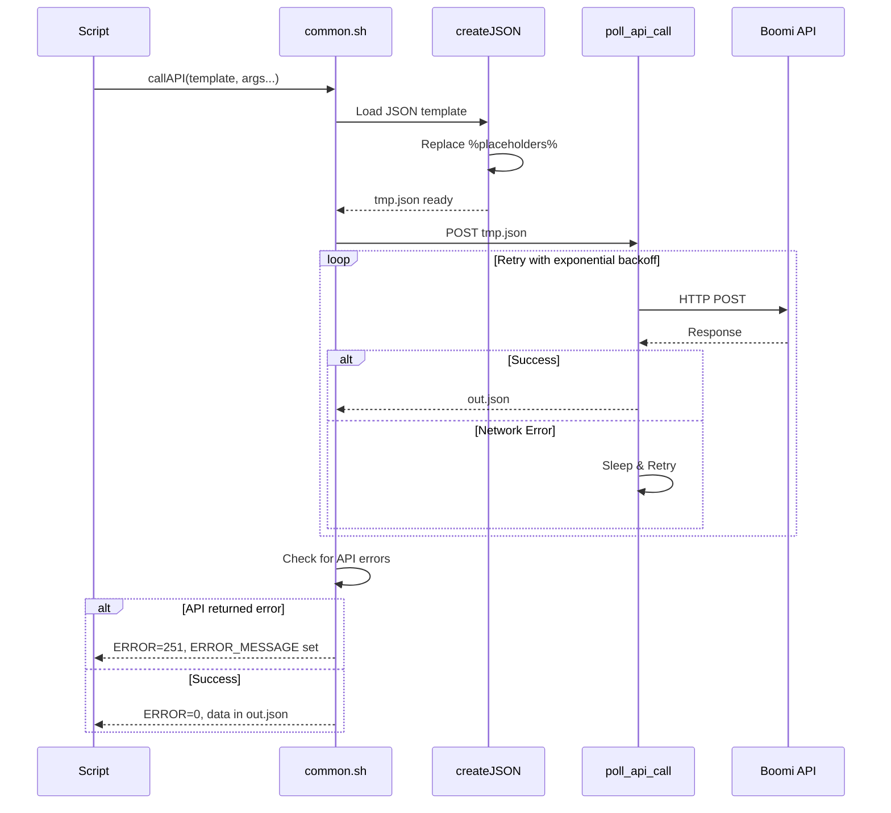

# Architecture

This document provides a deep dive into the design and architecture of the Boomi CI/CD CLI framework.

## Table of Contents

- [Design Philosophy](#design-philosophy)
- [System Architecture](#system-architecture)
- [Directory Structure](#directory-structure)
- [Core Components](#core-components)
- [API Interaction](#api-interaction)
- [Security Model](#security-model)
- [Error Handling](#error-handling)
- [Extension Points](#extension-points)

---

## Design Philosophy

The Boomi CI/CD CLI is built on four core principles:

### 1. Separation of Concerns

The framework clearly separates **what** (business logic) from **where** (CI/CD platform):

- **Core CLI** (`cli/scripts/`) - Pure Bash scripts with zero platform dependencies
- **Platform Templates** (`ci-templates/`) - Thin wrappers that set environment variables and call core scripts

This allows:
- Core scripts to evolve independently of any CI/CD platform
- Easy addition of new platforms without touching core logic
- Testing core logic without CI/CD infrastructure

### 2. Portability

All core scripts are designed for maximum portability:

- **Pure Bash 4.0+** - No platform-specific shell features
- **Standard Dependencies** - Only `jq`, `curl`, and `awk`
- **No Compiled Code** - All text-based scripts
- **Environment Variables** - Configuration via standard env vars

### 3. Security by Default

Security is baked into the architecture:

- **No Hardcoded Secrets** - All credentials via environment variables
- **Token Masking** - Automatic masking of `authToken` in logs
- **Secure Defaults** - No credential storage or caching
- **Audit Trail** - All API calls logged (with sensitive data masked)

### 4. Reliability

Production-grade reliability features:

- **Exponential Backoff** - Automatic retry with increasing delays
- **Input Validation** - All mandatory arguments checked before execution
- **Dependency Checks** - Required tools validated on startup
- **Graceful Degradation** - Clear error messages guide troubleshooting

---

## System Architecture



### Execution Flow

1. **CI/CD Platform** triggers a job/pipeline
2. **Wrapper Script** sets environment variables and calls core CLI
3. **Core CLI Script** validates inputs and prepares API payload
4. **common.sh** provides shared functions (API calls, error handling, logging)
5. **API Layer** calls Boomi AtomSphere REST API
6. **Response Handling** parses JSON, extracts values, returns to caller

---

## Directory Structure

```
boomi-cicd-cli/
├── cli/                                # Core, platform-agnostic CLI
│   └── scripts/
│       ├── bin/                        # All executable scripts (74 files)
│       │   ├── common.sh               # Shared utility functions
│       │   ├── deployPackages.sh       # Main deployment script
│       │   ├── executeProcess.sh       # Process execution
│       │   └── ... (71 other scripts)
│       ├── json/                       # API payload templates (49 files)
│       │   ├── DeployedPackage.json    # Deploy package payload
│       │   ├── PackagedComponent.json  # Package creation payload
│       │   └── ... (47 other templates)
│       └── conf/                       # Configuration files (8 files)
│           ├── xpath-rules.xml         # Code quality rules
│           └── ...
│
├── ci-templates/                       # CI/CD platform integrations
│   ├── azuredevops/                    # Azure DevOps (most complete)
│   │   ├── pipelines/                  # 21 YAML templates and wrappers
│   │   ├── docs/SETUP.md               # Azure-specific setup guide
│   │   └── examples/                   # Example configurations
│   ├── jenkins/
│   ├── github-actions/
│   ├── circleci/
│   ├── gitlab-ci/
│   └── teamcity/
│
├── docs/                               # Central documentation
│   ├── GETTING_STARTED.md              # Quickstart tutorial
│   ├── CLI_REFERENCE.md                # Complete command reference
│   └── ARCHITECTURE.md                 # This document
│
├── examples/                           # Cross-platform examples
│   └── common-workflows/               # Reusable workflow patterns
│
└── sonarqube/                          # Code quality integration
```

### Design Rationale

- **Flat `bin/` directory** - All scripts at same level for easy discovery
- **Templates in `json/`** - JSON templates use `%VARIABLE%` placeholders replaced by `sed`
- **Platform isolation** - Each CI/CD platform completely self-contained
- **Docs at root** - Central documentation accessible from any context

---

## Core Components

### common.sh - The Foundation

The heart of the framework. All scripts source `common.sh` to access:

#### Input Parsing
```bash
ARGUMENTS=(env packageVersion notes)
OPT_ARGUMENTS=(componentIds processNames)
inputs "$@"
```

- Validates all mandatory arguments are provided
- Exports arguments as environment variables
- Supports optional arguments with graceful defaults

#### API Interaction
```bash
function callAPI {
    # Creates JSON payload from template
    createJSON "$@"
    
    # Calls API with retry logic
    poll_api_call "$URL" "${WORKSPACE}/out.json" "POST" "${WORKSPACE}/tmp.json"
    
    # Parses response for errors
    check_for_api_errors
}
```

#### Secure Logging
```bash
function printArgs {
    for ARG in "${ARGUMENTS[@]}"; do
        if [ "$ARG" == "authToken" ]; then
            echo "$ARG=********"  # Masked!
        else
            echo "$ARG=${!ARG}"
        fi
    done
}
```

#### Dependency Validation
```bash
function check_dependencies {
    local deps=("jq" "curl" "awk")
    for dep in "${deps[@]}"; do
        if ! command -v "$dep" &> /dev/null; then
            echo "Error: Required dependency '$dep' is not installed."
            return 1
        fi
    done
}
```

### JSON Template System

Templates use simple placeholder replacement:

**Template (`DeployedPackage.json`):**
```json
{
  "@type": "DeployedPackage",
  "environmentId": "%envId%",
  "packageId": "%packageId%",
  "notes": "%notes%",
  "listenerStatus": "%listenerStatus%"
}
```

**Usage in Script:**
```bash
createJSON "DeployedPackage.json" \
    envId="$envId" \
    packageId="$packageId" \
    notes="$notes" \
    listenerStatus="$listenerStatus"
```

**Result:** `sed` replaces all `%var%` with actual values, output to `${WORKSPACE}/tmp.json`

### Workspace Pattern

All scripts use a workspace directory for intermediate files:

- `${WORKSPACE}/tmp.json` - API request payload
- `${WORKSPACE}/out.json` - API response
- `${WORKSPACE}/out.xml` - XML API responses
- `${WORKSPACE}/*.html` - Generated reports
- `${WORKSPACE}/tmps.json` - Debug: all requests
- `${WORKSPACE}/outs.json` - Debug: all responses

This provides:
- **Isolation** - Multiple concurrent runs don't conflict
- **Debugging** - All artifacts preserved for inspection
- **Cleanup** - Simple `rm -rf workspace/` to reset

---

## API Interaction

### Request Flow



### Retry Logic

Implemented in `poll_api_call`:

```bash
function poll_api_call {
    local url="$1"
    local output_file="$2"
    local method="$3"
    local data_file="$4"
    local max_retries=3
    local wait_time=1
    
    local attempt=1
    while [ $attempt -le $max_retries ]; do
        curl -s -X $method -u "$authToken" \
            -H "${h1}" -H "${h2}" \
            "$url" -d@"$data_file" > "$output_file"
        
        if [ -s "$output_file" ]; then
            return 0  # Success
        fi
        
        echo "Attempt $attempt failed. Retrying in $wait_time seconds..."
        sleep $wait_time
        attempt=$((attempt + 1))
        wait_time=$((wait_time * 2))  # Exponential backoff: 1s, 2s, 4s
    done
    
    echo "Error: API call failed after $max_retries attempts."
    return 1
}
```

### Error Detection

API responses are checked for error objects:

```bash
# Check if response contains "@type": "Error"
local is_error=$(jq -r . "${WORKSPACE}/out.json" | grep '"@type": "Error"' | wc -l)
if [[ $is_error -gt 0 ]]; then
    export ERROR_MESSAGE=$(jq -r .message "${WORKSPACE}/out.json")
    echo "API Error: $ERROR_MESSAGE"
    return 251
fi
```

---

## Security Model

### Credential Handling

1. **Input**: Credentials set as environment variables
   ```bash
   export authToken="$(echo -n 'ACCOUNT.user:token' | base64)"
   export baseURL="https://api.boomi.com/api/rest/v1/ACCOUNT/"
   ```

2. **Storage**: NEVER stored on disk, only in process memory

3. **Transmission**: Passed to `curl` via command-line arg (secure in single-user systems)
   ```bash
   curl -u "$authToken" ...
   ```

4. **Logging**: Automatically masked
   ```bash
   if [ "$ARG" == "authToken" ]; then
       echo "$ARG=********"
   fi
   ```

### Attack Surface

**Minimal:**
- No network listeners (CLI only makes outbound requests)
- No credential storage (ephemeral environment variables)
- No external dependencies beyond `jq/curl` (reduced supply chain risk)
- All user input validated before use

**Risks:**
- Environment variable exposure (mitigated by CI/CD secret management)
- Process listing may show `curl` commands (accept risk vs. complexity)
- Workspace files contain API responses (should be ephemeral, deleted post-run)

### Best Practices for Users

1. Use CI/CD platform secret management (Azure KeyVault, GitHub Secrets, etc.)
2. Mark `authToken` as masked/protected in CI/CD
3. Delete workspace after runs: `rm -rf workspace/`
4. Restrict CI/CD agent access to trusted users
5. Rotate Boomi API tokens regularly

---

## Error Handling

### Three-Tier Error System

1. **Validation Errors** (255) - Bad input, missing arguments
   ```bash
   if [ -z "${env}" ]; then
       echo "Missing mandatory field: env"
       return 255
   fi
   ```

2. **API Errors** (251) - Boomi platform rejected request
   ```bash
   if [[ $is_error -gt 0 ]]; then
       export ERROR=1
       export ERROR_MESSAGE=$(jq -r .message out.json)
       return 251
   fi
   ```

3. **Network Errors** (1) - Cannot reach Boomi API
   ```bash
   if [ $res -ne 0 ]; then
       echo "Network error contacting Boomi API"
       return 1
   fi
   ```

### Error Propagation

All scripts set global variables on error:

```bash
export ERROR=0        # 0 = success, >0 = error
export ERROR_MESSAGE=""  # Human-readable error description
```

Calling scripts check these:

```bash
source bin/deployPackages.sh env="Test" ...
if [ "$ERROR" -gt 0 ]; then
    echo "Deployment failed: $ERROR_MESSAGE"
    exit 1
fi
```

---

## Extension Points

### Adding New Scripts

1. **Follow the pattern:**
   ```bash
   #!/bin/bash
   if [ -z "${SCRIPTS_HOME}" ]; then
       SCRIPTS_HOME="$( cd "$( dirname "${BASH_SOURCE[0]}" )/.." && pwd )"
   fi
   source "${SCRIPTS_HOME}/bin/common.sh"
   
   ARGUMENTS=(arg1 arg2)
   OPT_ARGUMENTS=(optArg1)
   inputs "$@"
   
   # Your logic here
   
   clean
   ```

2. **Add JSON template** (if calling API): `cli/scripts/json/YourTemplate.json`

3. **Update CLI_REFERENCE.md** with usage documentation

### Adding New CI/CD Platform

1. **Create directory structure:**
   ```
   ci-templates/your-platform/
   ├── docs/SETUP.md
   ├── examples/
   └── pipelines/ (or configs/)
       └── deploy_packages.sh (wrapper)
   ```

2. **Wrapper script pattern:**
   ```bash
   #!/bin/bash
   export SCRIPTS_HOME="${CI_WORKSPACE}/cli/scripts"
   export WORKSPACE="${CI_WORKSPACE}/workspace"
   export authToken="${YOUR_PLATFORM_SECRET}"
   export baseURL="${YOUR_PLATFORM_VAR}"
   
   source "${SCRIPTS_HOME}/bin/deployPackages.sh" \
       env="${TARGET_ENV}" \
       componentIds="${COMPONENT_IDS}" \
       packageVersion="${BUILD_NUMBER}" \
       notes="Deployed via YourPlatform" \
       listenerStatus="RUNNING"
   ```

3. **Platform config** (YAML/Groovy/etc.) calls wrapper script

4. **Update main README** with link to your SETUP.md

### Custom Workflows

Chain multiple scripts for complex workflows:

```bash
# 1. Create package
source bin/createPackages.sh \
    componentIds="comp-1,comp-2" \
    packageVersion="2.0.0" \
    notes="Release 2.0"

# 2. Deploy to UAT
source bin/deployPackage.sh \
    env="UAT" \
    packageId="$packageId" \
    listenerStatus="RUNNING"

# 3. Execute test suite
source bin/executeTestSuite.sh \
    testSuiteName="Smoke Tests" \
    atomName="UAT-Atom"

# 4. If tests pass, deploy to Prod
if [ "$ERROR" -eq 0 ]; then
    source bin/deployPackage.sh \
        env="Production" \
        packageId="$packageId" \
        listenerStatus="RUNNING"
fi
```

---

## Performance Considerations

### API Rate Limiting

Boomi API has rate limits. The framework mitigates this:

- **SLEEP_TIMER** - Configurable delay between API calls (default: 0.2s)
- **Batching** - Deploy multiple components in one package vs. separate calls
- **Caching** - Query results stored in `out.json` for reuse within script

### Parallel Execution

Scripts CAN be run in parallel if:
- Different `WORKSPACE` directories used
- No shared state (each script is independent)

Example:
```bash
# Deploy to multiple environments in parallel
( export WORKSPACE=/tmp/ws-dev; source bin/deployPackages.sh env="Dev" ... ) &
( export WORKSPACE=/tmp/ws-qa;  source bin/deployPackages.sh env="QA" ... ) &
wait
```

### Optimization Tips

1. **Reduce verbosity** in production: `VERBOSE=false`
2. **Batch operations**: Deploy 10 components in one package vs. 10 separate deployments
3. **Reuse queries**: Call `queryEnvironment` once, parse for multiple envs
4. **Cleanup workspace**: Large `outs.json` files slow down disk I/O

---

## Testing Strategy

### Manual Testing

```bash
# Set up test environment
export SCRIPTS_HOME="$(pwd)/cli/scripts"
export WORKSPACE="$(pwd)/workspace-test"
export VERBOSE="true"
export authToken="..."  # Test account token
export baseURL="..."    # Test account URL

# Test individual script
source bin/queryEnvironment.sh env="*" classification="*"

# Verify output
cat workspace-test/out.json | jq '.result[].name'
```

### Integration Testing

CI/CD platform tests should:
1. Deploy to a test environment
2. Verify deployment succeeded
3. Execute a test process
4. Undeploy
5. Verify cleanup

### Syntax Validation

```bash
# Check all scripts for syntax errors
cd cli/scripts/bin
for script in *.sh; do
    bash -n "$script" || echo "Syntax error in $script"
done
```

---

## Future Enhancements

Potential architectural improvements:

1. **Config File Support** - YAML/JSON config instead of all env vars
2. **Logging Framework** - Structured logging (JSON) for better parsing
3. **Plugin System** - Dynamically load custom scripts
4. **REST API Mode** - Wrap CLI in REST API for remote execution
5. **Docker Container** - Pre-packaged runtime environment
6. **Unit Tests** - Mock API responses for isolated testing

---

## See Also

- [CLI Reference](CLI_REFERENCE.md) - All available commands
- [Getting Started](GETTING_STARTED.md) - Quick start guide
- [Contributing](../CONTRIBUTING.md) - Development guidelines
